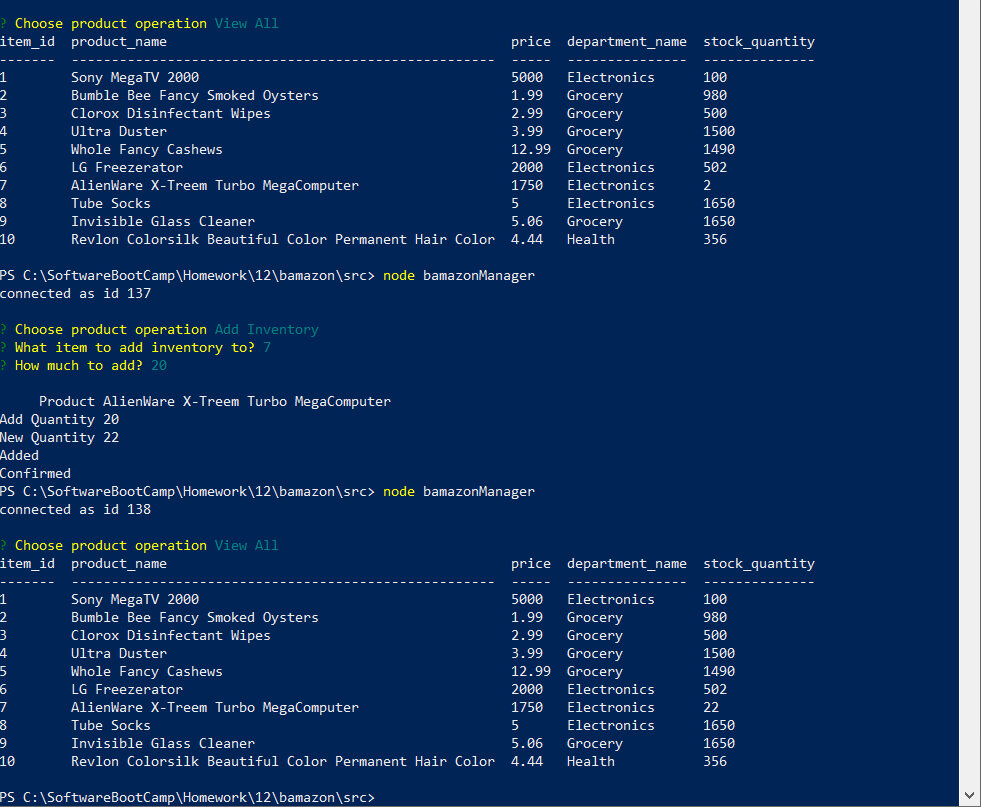
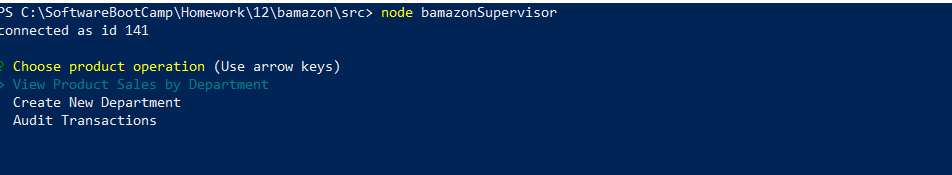

# bamazon

### Overview
Amazon-like storefront based on MySQL database.  There are three major functions: a customer 'app' that takes orders from customers, a manager app, and a supervisory app.

The manager app allows a manager to view the current inventory, view inventory items with less than 5 items in stock, add inventory to items, and add new items.

The supervisor app allows the supervisor to add departments, view sales by departments, and to audit transactions (customer sales, manager adds) that affect stock quantities.

### Detailed walk through.

With the starting inventory (as displayed by the manager application):

The customer app allows a customer to scroll through the list of items and select what they want to buy.  Then it asks them how many.

When the customer has made a selection, it confirms the purchase and displays all the pricing information.

The manager can see the change in inventory in their display screen.

The application presents the manager with other options

They can add inventory:

This will, of course, show up in the inventory display screen:

If the customer attempts to buy more inventory than there is, they will get an error message.

The manager can use their superpowers to see the inventory items that are low stock.

The manager can then use the app to add additional inventory.

The manager can add new products as well.

The supervisor has 3 options

They can add new departments

The supervisor can view the total sales by department.
The supervisor also can audit the buy/add inventory transactions.

